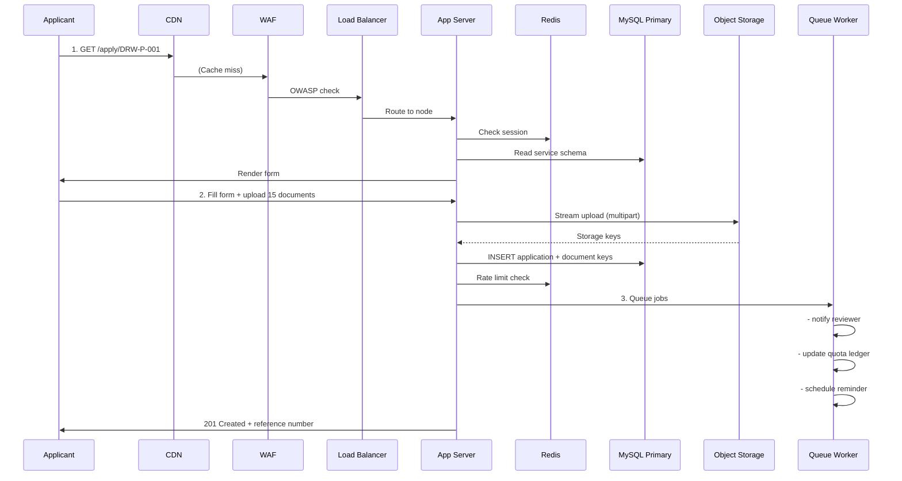
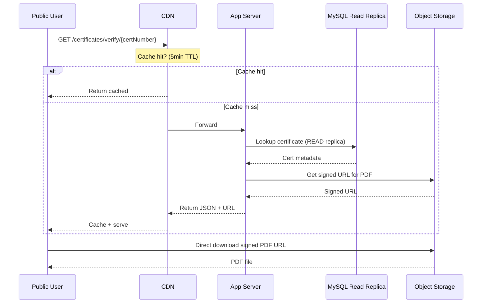
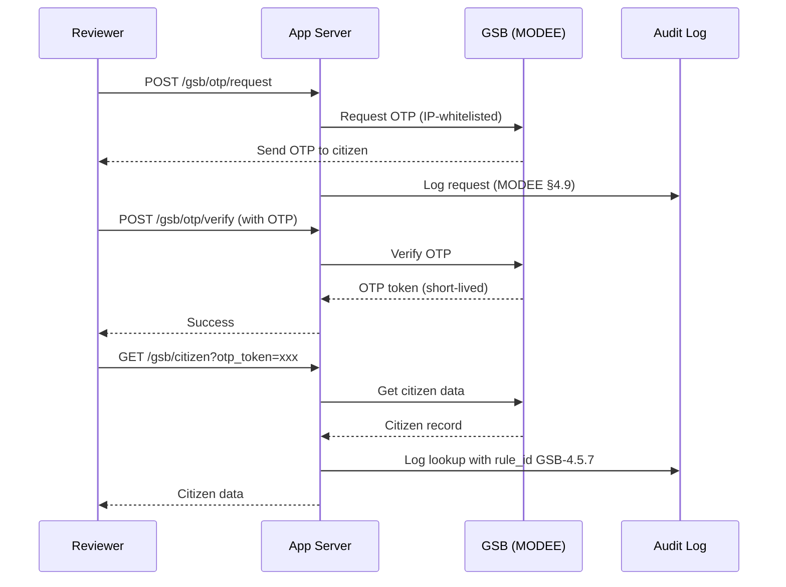

# JEA Production System Architecture

**Document:** System Architecture Design for JEA Digital Services Platform  
**Environment:** Production  
**Prepared by:** Eqratech · 2026-07-25  
**Scale:** 90,000 members · 80,000 buildings/year · ~15 documents per building

---

## 1. Executive Summary

هذه الوثيقة تُقدِّم **معمارية إنتاج كاملة** لنظام نقابة المهندسين الأردنيين (JEA Digital Services Platform)، مُصمَّمة لخدمة **90 ألف عضو** و **80 ألف مبنى سنوياً** (~220 معاملة/يوم) مع دعم رفع ~1.2 مليون مستند سنوياً.

المبادئ الأساسية:
- **High Availability** — لا نقطة فشل واحدة (No SPOF)
- **Horizontal Scale** — نمو أفقي للتطبيق والقراءة
- **Zero-Downtime Deployments** — blue/green + rolling
- **Regulatory Compliance** — CSP, WAF, audit trail, MODEE Annex 4.15 (GSB)
- **Disaster Recovery** — RPO ≤ 15min، RTO ≤ 1h

---

## 2. Scale Requirements

| المتطلَّب | القيمة | الأثر التصميمي |
|-----------|--------|-----------------|
| المستخدمون المسجَّلون | 90,000 | Auth cache, session store, user management |
| مبانٍ سنوياً | 80,000 | ~220/day, ~9/hour peak |
| مستندات سنوياً | ~1.2M | Object storage 1-2 TB in year 1, grow 30%/y |
| متزامنون في الذروة | ~500-1,000 | 3-5 app servers minimum + auto-scale |
| Reviewer decisions/day | ~200-400 | Read-heavy dashboard queries → replicas |
| Peak concurrent uploads | 20-50 | Streaming to object storage |
| Certificate verifications/day | 500-2000+ (public) | CDN critical |

---

## 3. Architecture Overview

### 3.1 High-Level Diagram (Mermaid)

```mermaid
graph TB
    subgraph Public["🌐 Public Internet"]
        Applicants["Applicants (المكاتب الهندسية)"]
        Reviewers["Reviewers/Auditors"]
        Admins["JEA Admins"]
        Public3P["Public — Certificate Verification"]
    end

    subgraph Edge["Edge Layer"]
        CDN["CDN<br/>(Cloudflare/AWS CloudFront)"]
        WAF["Cloud WAF + DDoS Protection"]
        DNS["DNS<br/>(Route53/Cloudflare)"]
    end

    subgraph LB_Layer["Load Balancing"]
        ALB["Application Load Balancer<br/>(TLS termination, Port 443)"]
    end

    subgraph App_Tier["Application Tier — Auto-Scaling"]
        App1["Laravel App #1<br/>PHP 8.4, 4vCPU/8GB"]
        App2["Laravel App #2<br/>PHP 8.4, 4vCPU/8GB"]
        App3["Laravel App #3<br/>PHP 8.4, 4vCPU/8GB"]
        AppN["... up to 10 nodes"]
    end

    subgraph Support["Support Services"]
        Redis["Redis Cluster<br/>(Sessions + Cache + Rate Limits)<br/>2 nodes + Sentinel"]
        Queue["Queue Workers<br/>(Horizon)<br/>2-4 workers"]
        Frontend["Frontend<br/>(Vite build → S3 + CDN)"]
    end

    subgraph Data_Tier["Data Tier — Private VLAN"]
        DBPrimary["MySQL Primary<br/>8vCPU/32GB<br/>500GB SSD"]
        DBReplica1["MySQL Replica 1<br/>(Reads)"]
        DBReplica2["MySQL Replica 2<br/>(Reads)"]
        Backup["Automated Backup<br/>(daily + PITR)"]
    end

    subgraph Storage["Object Storage"]
        S3["S3-Compatible<br/>(MinIO / Backblaze B2 / AWS S3)<br/>• Documents<br/>• Certificates PDF<br/>• Backups"]
    end

    subgraph External["External Integrations"]
        GSB["GSB (MODEE)<br/>Citizen Lookup"]
        Nashmi["Nashmi Webhook"]
        Payment["Payment Gateway<br/>(eFAWATEERcom / Bank)"]
        SMS["SMS Provider<br/>(Zain / Umniah)"]
        Email["Email SMTP<br/>(SES / Mailgun)"]
    end

    subgraph Observability["Observability Stack"]
        Logs["Log Aggregation<br/>(ELK / CloudWatch)"]
        Metrics["Metrics<br/>(Prometheus + Grafana)"]
        Alerts["Alerting<br/>(PagerDuty / Slack)"]
        APM["APM (Optional)<br/>(New Relic / Datadog)"]
    end

    Applicants --> DNS
    Reviewers --> DNS
    Admins --> DNS
    Public3P --> CDN

    DNS --> WAF
    CDN --> WAF
    WAF --> ALB

    ALB --> App1
    ALB --> App2
    ALB --> App3
    ALB --> AppN

    App1 --> Redis
    App2 --> Redis
    App3 --> Redis
    AppN --> Redis

    App1 --> Queue
    Queue --> Email
    Queue --> SMS

    App1 --> DBPrimary
    App2 --> DBPrimary
    App3 --> DBReplica1
    AppN --> DBReplica2

    DBPrimary -.replication.-> DBReplica1
    DBPrimary -.replication.-> DBReplica2
    DBPrimary --> Backup

    App1 --> S3
    S3 --> CDN

    App1 --> GSB
    App1 --> Payment
    Nashmi --> WAF

    App1 -.logs.-> Logs
    App1 -.metrics.-> Metrics
    Metrics --> Alerts

    style CDN fill:#f9f,stroke:#333
    style WAF fill:#f96,stroke:#333
    style DBPrimary fill:#9cf,stroke:#333
    style S3 fill:#fc9,stroke:#333
    style Redis fill:#f66,stroke:#333,color:#fff
```



### 3.2 ASCII Overview (Fallback)

```
                                    🌐 Internet
                                         │
                    ┌────────────────────┼────────────────────┐
                    ▼                    ▼                    ▼
              Applicants           Reviewers/Admins   Public (Cert Verify)
                    │                    │                    │
                    └────────────────────┼────────────────────┘
                                         │
                                    ┌────▼──────┐
                                    │    CDN    │  (Cloudflare/CloudFront)
                                    └────┬──────┘
                                         │
                                    ┌────▼──────────────────┐
                                    │  Cloud WAF + DDoS      │
                                    │  (rate limit, geoblock)│
                                    └────┬──────────────────┘
                                         │
                                    ┌────▼──────────────────┐
                                    │  Application LB (:443) │
                                    │  TLS termination + SNI │
                                    └────┬──────────────────┘
                                         │
              ┌──────────────┬───────────┼───────────┬──────────────┐
              ▼              ▼           ▼           ▼              ▼
       ┌───────────┐  ┌───────────┐ ┌───────────┐ ┌───────────┐   ...
       │  App #1   │  │  App #2   │ │  App #3   │ │  App #N   │  (auto-scale)
       │ Laravel + │  │ Laravel + │ │ Laravel + │ │ Laravel + │  (min 3, max 10)
       │ PHP 8.4   │  │ PHP 8.4   │ │ PHP 8.4   │ │ PHP 8.4   │
       │ 4vCPU/8GB │  │ 4vCPU/8GB │ │ 4vCPU/8GB │ │ 4vCPU/8GB │
       └─────┬─────┘  └─────┬─────┘ └─────┬─────┘ └─────┬─────┘
             │              │             │             │
             └──────────────┼─────────────┼─────────────┘
                            │             │
       ┌────────────────────┴─────────────┴──────────────────────┐
       │                                                          │
       │   ┌──────────────┐    ┌──────────────────────┐          │
       │   │    Redis     │    │  Queue Workers        │          │
       │   │  Cluster     │    │  (Horizon x 2-4)      │          │
       │   │  (Sessions,  │    │  • cron jobs          │          │
       │   │   Cache,     │    │  • notifications      │          │
       │   │   Rate Lim.) │    │  • cert generation    │          │
       │   └──────────────┘    │  • integration retry  │          │
       │                        └──────────────────────┘          │
       │                                                           │
       │   ┌────────────────────────────────────────────┐         │
       │   │   Object Storage (S3-Compatible)            │         │
       │   │   • Application documents (~1.2M/year)      │         │
       │   │   • Generated certificate PDFs              │         │
       │   │   • Database backups                        │         │
       │   │   • Signed URLs for downloads               │         │
       │   └──────────────────┬─────────────────────────┘         │
       └──────────────────────┼─────────────────────────────────────┘
                              │
                              └─────► CDN (public cert URLs)

                    ┌─────────────────────────────────┐
                    │        Private VLAN              │
                    │        (DB tier isolated)        │
                    └────────────────┬────────────────┘
                                     │
        ┌────────────────────────────┼────────────────────────┐
        ▼                            ▼                        ▼
┌───────────────┐          ┌────────────────┐        ┌────────────────┐
│ MySQL Primary │          │ MySQL Replica  │        │ MySQL Replica  │
│               │          │      #1        │        │      #2        │
│ 8vCPU/32GB    │◄─────────┤   (Reads)      │◄───────┤   (Reads)      │
│ 500GB SSD     │  binlog  │                │        │                │
│ (Writes only) │          │                │        │                │
└───────┬───────┘          └────────────────┘        └────────────────┘
        │
        ▼
┌─────────────────────────────────────────────┐
│  Automated Backup                            │
│  • Full backup daily (S3 encrypted)          │
│  • Point-in-Time Recovery (binlog shipping)  │
│  • Retention: 30 days                        │
│  • Cross-region copy (DR)                    │
└─────────────────────────────────────────────┘

External Integrations (all through the App tier via HTTPS):
┌───────────────────────────────────────────────────────────┐
│  GSB (MODEE)     — Citizen data lookup (OTP + IP whitelist)│
│  Nashmi Webhook  — Bidirectional (X-Integration-Key)       │
│  Payment Gateway — eFAWATEERcom / Arab Bank                │
│  SMS Provider    — Zain / Umniah / Orange                  │
│  Email SMTP      — AWS SES / Mailgun                       │
└───────────────────────────────────────────────────────────┘

Observability Stack:
┌───────────────────────────────────────────────────────────┐
│  Logs        → ELK (Elasticsearch/Logstash/Kibana) or      │
│                 AWS CloudWatch Logs                         │
│  Metrics     → Prometheus + Grafana                        │
│                 (P95 latency, error rate, throughput, DB)  │
│  Alerts      → PagerDuty / Slack (on-call rotation)        │
│  APM         → New Relic / Datadog (optional)              │
│  Uptime      → Statuspage.io / Better Uptime               │
└───────────────────────────────────────────────────────────┘
```

---

## 4. Component Specifications

### 4.1 Edge Layer

| Component | Technology | Purpose | Sizing |
|-----------|-----------|---------|--------|
| **DNS** | Route53 / Cloudflare DNS | Domain resolution, health checks | Standard |
| **CDN** | Cloudflare / CloudFront | Static assets, public cert PDFs | Pro tier ($20-100/mo) |
| **WAF** | Cloudflare WAF / AWS WAF | OWASP top 10, rate limit, geoblock | Managed rules |
| **DDoS Protection** | Cloudflare / AWS Shield | Volumetric + application-layer | Standard/Advanced |

### 4.2 Application Tier

| Component | Technology | Sizing | Notes |
|-----------|-----------|--------|-------|
| **Load Balancer** | AWS ALB / nginx | Health checks every 15s | Sticky sessions OFF (stateless) |
| **App Server** | Laravel 13 + PHP 8.4 + Nginx/PHP-FPM | 4 vCPU / 8 GB RAM / 50 GB SSD | Min 3, max 10, auto-scale on CPU>70% |
| **Frontend** | Vite build → static files on CDN | N/A | Served from S3+CDN, not app tier |
| **Deploy Strategy** | Blue/Green or Rolling | Zero downtime | Health checks gate traffic shift |

### 4.3 Data Tier

| Component | Technology | Sizing | Notes |
|-----------|-----------|--------|-------|
| **MySQL Primary** | MySQL 8.0 / MariaDB | 8 vCPU / 32 GB RAM / 500 GB SSD (gp3) | Writes only, IOPS 3000+ |
| **MySQL Read Replicas** | MySQL 8.0 (async replication) | 4 vCPU / 16 GB RAM / 500 GB SSD × 2 | Reviewer dashboards, reports |
| **Backups** | mysqldump + binlog to S3 | Full daily + PITR | Encrypted at rest, cross-region copy |
| **Redis Cluster** | Redis 7 + Sentinel | 2 vCPU / 4 GB × 2 nodes | Sessions, cache, rate limits, queue |
| **Queue Workers** | Laravel Horizon | 2-4 worker nodes (2 vCPU / 4 GB each) | Notifications, cron, cert generation |

### 4.4 Storage

| Component | Technology | Capacity | Notes |
|-----------|-----------|----------|-------|
| **Object Storage** | MinIO / Backblaze B2 / AWS S3 | Start 1 TB, grow ~30%/y | Documents + certificates + backups |
| **CDN Cache** | Cloudflare | Auto-managed | Serves signed URLs from object storage |

### 4.5 External Integrations

| Integration | Purpose | Auth | Handled by |
|-------------|---------|------|-----------|
| **GSB (MODEE)** | Citizen data lookup (name, ID lookup for compliance) | OTP + IP whitelist (§4.5 rule 11) | `Integrations\Gsb\` |
| **Nashmi** | Contractor management webhook (bidirectional) | X-Integration-Key header | `Integrations\Nashmi\` |
| **Payment Gateway** | Fee collection (eFAWATEERcom, banks) | API key + HMAC signature | New: `Integrations\Payment\` |
| **SMS** | OTP + notifications (Arabic) | API key | Provider abstraction |
| **Email SMTP** | Transactional email (Arabic + English) | SMTP creds | Laravel Mail |

---

## 5. Data Flow Diagrams

### 5.1 Application Submission Flow



### 5.2 Public Certificate Verification (High-Volume Path)



### 5.3 Integration Flow — GSB Citizen Lookup



---

## 6. Security Model

### 6.1 Defense in Depth

| Layer | Control | Implementation |
|-------|---------|----------------|
| **1. Edge** | DDoS + WAF | Cloudflare/AWS Shield + managed OWASP rules |
| **2. Transport** | TLS 1.3 only | LB terminates, HSTS, cert auto-renewal |
| **3. Application** | Authentication | Sanctum + httpOnly cookies + CSRF |
| **3. Application** | Authorization | Role-based (`CheckRole` middleware) + policy layer |
| **3. Application** | Input validation | `FormRequest` + `SchemaValidator` |
| **3. Application** | Rate limiting | `throttle:*` limiters with Redis backend |
| **3. Application** | Session security | 30-min inactivity timeout + rotation |
| **3. Application** | CSP + Security Headers | `SecurityHeaders` middleware |
| **4. Data** | Encryption at rest | RDS/EBS encryption + S3 SSE |
| **4. Data** | Encryption in transit | TLS to DB, private VLAN |
| **4. Data** | Backup encryption | S3-managed keys + cross-region copy |
| **5. Audit** | Full audit trail | `AuditLog` table + `rule_id` per action |
| **5. Audit** | Log aggregation | ELK/CloudWatch retention 90 days min |
| **6. Access** | IAM + IP whitelist | GSB IP whitelist enforced by middleware |
| **6. Access** | Secrets management | AWS Secrets Manager / HashiCorp Vault |

### 6.2 Compliance Checklist

- ✅ **MODEE Annex 4.15** — GSB IP whitelist + audit log
- ✅ **JEA data protection** — Encrypted at rest + in transit
- ✅ **OWASP Top 10** — WAF + input validation + parameterized queries
- ⏳ **Jordan Data Protection Law 2023** — Consent, retention limits, right-to-be-forgotten (add if needed)
- ⏳ **PCI-DSS** (if handling card data directly) — probably not, payment gateway handles it

---

## 7. High Availability & Disaster Recovery

### 7.1 HA Targets

| Metric | Target |
|--------|--------|
| **Uptime SLA** | 99.9% (43 min downtime/month allowed) |
| **RPO** (Recovery Point Objective) | ≤ 15 minutes |
| **RTO** (Recovery Time Objective) | ≤ 1 hour |

### 7.2 Redundancy Matrix

| Component | Redundancy | Failure Scenario |
|-----------|-----------|-------------------|
| App servers | Auto-scale group 3+ across AZs | Any node dies → LB removes, auto-replaces |
| DB Primary | Automated snapshot every 6h + binlog shipping | Failover to replica in <5min |
| DB Replicas | 2× replicas | Reviewer dashboards degrade gracefully |
| Redis | Master + Sentinel + 1 replica | Sentinel promotes replica automatically |
| Object Storage | S3 multi-AZ (11 nines durability) | Data essentially indestructible |
| CDN | Multi-POP (global) | Regional failure → auto-reroute |
| Nashmi/GSB | Retry with exponential backoff | Circuit breaker after N failures |

### 7.3 DR Plan (Regional Failure)

1. **Detection** — health check fails 3× consecutive from 2+ regions
2. **Failover** — DNS switches to DR region (TTL 60s)
3. **Data** — DR region has async replica (RPO 15min max)
4. **App** — DR region has warm standby (3 min to full scale)
5. **Verification** — smoke tests + manual review before public

---

## 8. Monitoring & Observability

### 8.1 Golden Signals (Per Service)

- **Latency** — P50, P95, P99 (target: P95 < 500ms)
- **Traffic** — Requests/sec per endpoint
- **Errors** — 5xx rate < 0.1%, 4xx trend
- **Saturation** — CPU, memory, DB connections, queue depth

### 8.2 Dashboards (Grafana)

| Dashboard | Metrics |
|-----------|---------|
| **Application Health** | Request rate, error rate, latency, active users |
| **Database** | Connections, slow queries, replication lag, disk |
| **Queue** | Jobs processed, failed jobs, queue depth by class |
| **Business** | Applications/day, decisions/day, cert issued, revenue |
| **Integrations** | GSB call success rate, Nashmi webhook lag |
| **Infrastructure** | CPU, memory, network, disk I/O per node |

### 8.3 Alerting Thresholds

| Severity | Condition | Action |
|----------|-----------|--------|
| **P1 Critical** | 5xx rate > 5% for 2min OR DB primary down | Page on-call + incident channel |
| **P2 High** | P95 latency > 2s for 5min OR queue > 1000 | Slack alert + investigate |
| **P3 Warning** | Disk > 80% OR replica lag > 30s | Ticket for review |
| **P4 Info** | Deploy events, cron completions | Log only |

---

## 9. Cost Estimate (Monthly, Rough)

**Assuming AWS-equivalent pricing in JOD (USD × 0.71).**

| Component | Est. USD/mo | Notes |
|-----------|-------------|-------|
| App servers (3-5 × m5.large avg) | $250-400 | Auto-scale, spot for staging |
| DB Primary (RDS db.m5.2xlarge) | $500 | Reserved 1-year: -30% |
| DB Replicas × 2 (db.m5.xlarge) | $500 | Reserved 1-year: -30% |
| Redis (ElastiCache cache.m5.large × 2) | $200 | |
| Object Storage (1-2 TB + egress) | $50-150 | Grows with usage |
| CDN (Cloudflare Pro) | $20-100 | Or Cloudflare Free for low traffic |
| WAF | $50-100 | Managed rules |
| Load Balancer | $25 | ALB base + LCU |
| Backup storage (S3 + cross-region) | $30-80 | 500 GB × 30 days retention |
| Monitoring (CloudWatch/Datadog) | $100-300 | Depends on retention |
| SMS + Email | $200-800 | Volume-dependent |
| **Total (year 1)** | **~$1,900-2,700/mo (~JOD 1,400-1,900)** | Excluding one-time setup |

*JOD equivalent for Hostinger/local hosting will differ. Above assumes public cloud.*

---

## 10. Deployment Phases

### Phase 0 — Prerequisites (Week 1)
- Provision AWS/cloud account + billing setup
- DNS + domain (jea.jo or similar)
- SSL certificates (Let's Encrypt or paid CA)

### Phase 1 — Foundation (Weeks 2-3)
- VPC, subnets (public + private + isolated)
- IAM roles + secrets management
- CI/CD pipeline (GitHub Actions → deploy)
- Object storage + CDN setup

### Phase 2 — Data Tier (Week 4)
- MySQL primary (managed service preferred)
- 2 read replicas
- Backup automation + PITR
- Redis cluster

### Phase 3 — Application Tier (Weeks 5-6)
- Auto-scaling group with launch template
- Load balancer + health checks
- Migrate DB schema + seed catalog
- Frontend build → CDN

### Phase 4 — Integrations (Week 7)
- GSB adapter deploy + IP whitelist
- Nashmi webhook validation
- Payment gateway integration + testing
- SMS + Email providers

### Phase 5 — Observability (Week 8)
- Log aggregation
- Metrics + dashboards
- Alerting rules + on-call rotation
- Runbook for common failures

### Phase 6 — Hardening (Week 9)
- WAF rule tuning (start permissive, tighten)
- Penetration testing
- Load testing (target 500 concurrent users)
- DR drill

### Phase 7 — Go-Live (Week 10)
- Soft launch (whitelist users)
- Monitor tightly for 2 weeks
- Full public launch

---

## 11. Key Decisions to Confirm

Before finalizing, please decide:

| Decision | Options |
|----------|---------|
| **Cloud provider** | AWS / Azure / GCP / on-premises (Hostinger unlikely to scale) |
| **Data region** | Jordan (data-sovereignty) or Middle East region (Bahrain, UAE) |
| **DB managed vs self** | RDS/Aurora (recommended) vs self-managed MySQL |
| **Object storage** | AWS S3 vs Backblaze vs self-hosted MinIO |
| **Payment gateway** | eFAWATEERcom / Arab Bank / Cliq — depends on NGO agreement |
| **SMS/Email provider** | Local (Zain/Umniah) vs global (Twilio/SES) |
| **Monitoring stack** | CloudWatch (managed) vs Prometheus+Grafana (self-hosted) |
| **DR strategy** | Warm standby (recommended for RTO=1h) vs cold backup (RTO=8h+) |

---

## 12. Comparison: SPAC Reference Architecture vs This Proposal

| Aspect | SPAC (Reference) | This Proposal | Why Different |
|--------|------------------|---------------|---------------|
| App servers | 2 fixed | 3-10 auto-scale | JEA scale requires horizontal elasticity |
| Database | Single MySQL Primary | Primary + 2 read replicas + PITR | 90k users need read scaling + HA |
| File storage | Not shown (implied filesystem) | Object storage + CDN | 1.2M docs/y kills local filesystem |
| Cache/Session | Not shown | Redis cluster | Sessions + rate limits + queue |
| Queue | Not shown | Horizon workers | Cron jobs + async notifications |
| CDN | Not shown | Cloudflare/CloudFront | Public cert verification traffic |
| Observability | Not shown | ELK + Prometheus + Grafana | Production needs visibility |
| Integrations | SMS + External SQL + Job API | GSB + Nashmi + Payment + SMS + Email | JEA's real dependencies |
| DR | Not shown | Cross-region async + failover | Regulatory + business continuity |
| CI/CD | Not shown | Blue/Green pipeline | Zero-downtime deploys |

---

## 13. Handoff Checklist for Implementation

- [ ] Cloud account provisioned + billing alerts
- [ ] Domain + DNS configured
- [ ] SSL certificates issued
- [ ] VPC + network isolation established
- [ ] Database provisioned + backups tested
- [ ] Redis cluster verified
- [ ] Object storage bucket created + IAM configured
- [ ] Load balancer + health checks operational
- [ ] Application auto-scale group + launch template
- [ ] CI/CD pipeline (GitHub → deploy)
- [ ] External integrations tested end-to-end
- [ ] Observability stack ingesting from all layers
- [ ] Alerting routed to on-call
- [ ] Runbook written for top 5 failure modes
- [ ] Load test completed at 2× expected peak
- [ ] DR drill executed successfully
- [ ] Security review + pen test complete
- [ ] Documentation handed to operations team

---

**End of document.**  
Prepared by ESP v2 architecture team, 2026-07-25.  
Sources: `docs/architecture/*`, `docs/manual-summary.md`, `docs/EDA_DECISION_CHAIN.md`, SPAC reference diagram.
